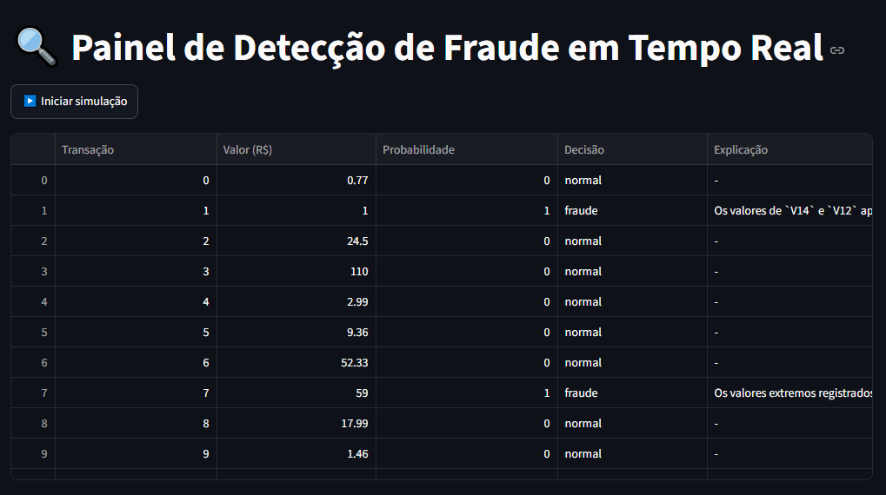
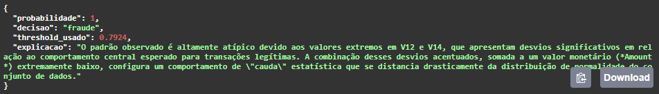

# 🔍 API de Detecção de Fraude em Transações de Cartão de Crédito

API de Machine Learning para detecção de fraude em transações financeiras, com modelo XGBoost, threshold tuning orientado a negócio, explicações em linguagem natural geradas por LLM (Gemini) e painel de simulação em tempo real.

🔗 **API em produção:** [https://fraude-deteccao.onrender.com/docs](https://fraude-deteccao.onrender.com/docs)

> ⚠️ A API está hospedada no plano gratuito do Render, que "dorme" após períodos de inatividade. A primeira requisição pode levar de 30 a 50 segundos para responder enquanto o serviço reinicia.

---

## 📌 Visão geral

Este projeto vai além de treinar um modelo de classificação: ele documenta um processo real de decisão técnica, desde o tratamento de um dataset extremamente desbalanceado (0,17% de fraude) até a publicação de um serviço de ML consumível via API, com uma camada adicional de IA generativa para tornar os resultados mais interpretáveis para um analista de negócio.

**Pipeline do projeto:**

```
Dataset (Kaggle/ULB) → EDA → Modelagem (XGBoost + threshold tuning)
    → API (FastAPI + segurança) → Explicação (Gemini) → Deploy (Render)
    → Painel de simulação (Streamlit)
```

---

## 📊 O dataset

- **Fonte:** [Credit Card Fraud Detection](https://www.kaggle.com/mlg-ulb/creditcardfraud) (Kaggle/ULB) — transações reais de cartões europeus.
- **284.807 transações**, das quais apenas **492 (0,17%)** são fraudulentas.
- Features `V1` a `V28` são componentes anônimos derivados de PCA (por confidencialidade); `Amount` e `Time` são as únicas variáveis originais.

**Insight de negócio encontrado na EDA:** fraudes apresentam mediana de valor bem menor que transações normais (R$ 9,25 vs R$ 22,00), mas média maior (R$ 122 vs R$ 88) — um padrão compatível com *card testing* (transações de valor baixo para testar se um cartão roubado ainda está ativo, seguidas por tentativas de valor mais alto).

---

## 🧠 Modelagem: o processo de decisão

O maior desafio técnico do projeto foi o desbalanceamento extremo das classes. Em vez de aplicar a primeira técnica "padrão" encontrada em tutoriais, o projeto testou múltiplas abordagens e comparou os resultados de forma crítica:

| Abordagem | Precision | Recall | F1 | AUPRC |
|---|---|---|---|---|
| Regressão Logística (baseline, threshold 0.5) | 0,827 | 0,633 | 0,743 | 0,741 |
| Regressão Logística + `class_weight='balanced'` | 0,061 | 0,918 | 0,114 | 0,719 |
| Regressão Logística + SMOTE | 0,058 | 0,918 | 0,109 | 0,724 |
| Regressão Logística + threshold tuning | 0,701 | 0,765 | 0,732 | 0,741 |
| XGBoost (puro) | 0,897 | 0,796 | 0,843 | 0,781 |
| XGBoost + `scale_pos_weight` | 0,871 | 0,827 | 0,848 | 0,879 |
| **XGBoost + `scale_pos_weight` + threshold tuning (final)** | **0,900** | **0,827** | **0,862** | **0,879** |

**Principais aprendizados documentados:**
- `class_weight`/SMOTE, em um modelo linear, deslocam a fronteira de decisão de forma bruta — melhoraram o recall, mas destruíram a precision (de ~83% para ~6%), tornando o modelo inviável em produção (~1.385 falsos positivos para capturar 90 fraudes).
- **Threshold tuning** no baseline recuperou grande parte do recall perdido sem sacrificar tanto a precision — evidência de que ajustar o ponto de corte de decisão é, muitas vezes, mais eficaz do que reamostrar os dados.
- **XGBoost** capturou interações não-lineares entre as variáveis que a Regressão Logística não conseguia, elevando a AUPRC de 0,741 para 0,879 — uma melhoria estrutural, não apenas um deslocamento de corte.
- O `scale_pos_weight` do XGBoost, ao contrário do `class_weight` da Regressão Logística, melhorou a AUPRC de forma genuína, por atuar sobre centenas de árvores individuais em vez de uma única fronteira linear.

**Modelo final:** XGBoost com `scale_pos_weight` e threshold ajustado para maximizar recall mantendo precision ≥ 0.90 — captura **82,7% das fraudes reais** com apenas ~9 falsos positivos a cada ~90 fraudes identificadas.

---

## 🌐 API (FastAPI)

### Endpoint principal

`POST /score`

**Requisição (exemplo resumido):**
```json
{
  "Time": 406.0,
  "V1": -2.31,
  "V2": 1.95,
  "...": "...",
  "V28": 0.01,
  "Amount": 0.0
}
```

**Resposta:**
```json
{
  "probabilidade": 0.97,
  "decisao": "fraude",
  "threshold_usado": 0.7924,
  "explicacao": "Os valores negativos extremos de V14 e V12 indicam um afastamento acentuado da média populacional..."
}
```

- Validação automática de entrada via **Pydantic**.
- Documentação interativa (Swagger) disponível em `/docs`.

### 🔐 Segurança

O endpoint `/score` é protegido por uma chave própria (`x-api-key`), separada da chave da API do Gemini, para evitar consumo indevido da cota gratuita do LLM por tráfego automatizado.

```
x-api-key: 7396d0b180c18e091e9d664630a432e6
```

> Chave de demonstração disponibilizada apenas para fins de teste deste portfólio.

---

## 🤖 Explicação via LLM (Gemini)

Quando uma transação é classificada como fraude, a API chama o modelo **Gemini 3.1 Flash-Lite** (Google) para gerar uma explicação em linguagem natural, com base na probabilidade e nas features de maior importância para o modelo naquela transação específica.

- O prompt instrui explicitamente o modelo a **não inventar significados de negócio** para as variáveis `V1-V28` (que são anônimas via PCA), evitando alucinação.
- A explicação só é gerada para transações sinalizadas como fraude, controlando custo/uso da API.
- **Resiliência:** se a chamada ao LLM falhar (timeout, indisponibilidade, limite de cota), a API continua respondendo normalmente com o score e a decisão — a funcionalidade crítica (detecção) nunca depende da funcionalidade acessória (explicação).

---

## 📺 Painel de simulação (Streamlit)

Um painel local simula transações "chegando" em tempo real, consumindo a própria API publicada no Render e exibindo os resultados (score, decisão e explicação) dinamicamente.

```bash
streamlit run painel.py
```



---

## 🚀 Como rodar localmente

```bash
# Clonar o repositório
git clone https://github.com/Williamveri/fraude-deteccao.git
cd fraude-deteccao

# Criar e ativar ambiente virtual
python -m venv venv
venv\Scripts\Activate.ps1      # Windows

# Instalar dependências
pip install -r requirements.txt
```

Criar um arquivo `.env` na raiz do projeto com:
```
GEMINI_API_KEY=sua_chave_do_gemini
MINHA_API_KEY=sua_chave_de_api_propria
```

Subir a API:
```bash
uvicorn main:app --reload
```
Acessar `http://127.0.0.1:8000/docs`.

Rodar o painel de simulação (opcional):
```bash
streamlit run painel.py
```

---

## 🗂️ Estrutura do projeto

```
fraude_deteccao/
├── main.py                    # API FastAPI
├── painel.py                  # Painel Streamlit de simulação
├── requirements.txt
├── amostra_transacoes.csv     # Amostra usada pelo painel
├── modelo_fraude_xgb.pkl      # Modelo treinado
├── scaler.pkl                 # Scaler (StandardScaler)
├── threshold.txt              # Threshold de decisão ajustado
├── notebooks/
│   └── eda_e_modelagem.ipynb  # EDA e todo o processo de modelagem
├── imagens/                   # Prints/gráficos usados neste README
└── .gitignore
```

---

## 🛠️ Stack técnica

- **Linguagem:** Python
- **Modelagem:** scikit-learn, XGBoost, imbalanced-learn
- **API:** FastAPI, Pydantic, Uvicorn
- **LLM:** Google Gemini (google-genai)
- **Visualização:** Streamlit, Matplotlib
- **Deploy:** Render

---

## 📸 Demonstração

Exemplo de resposta da API para uma transação sinalizada como fraude, incluindo a explicação gerada pelo Gemini:



---

## 👤 Autor

William Verissimo
[GitHub](https://github.com/Williamveri)
